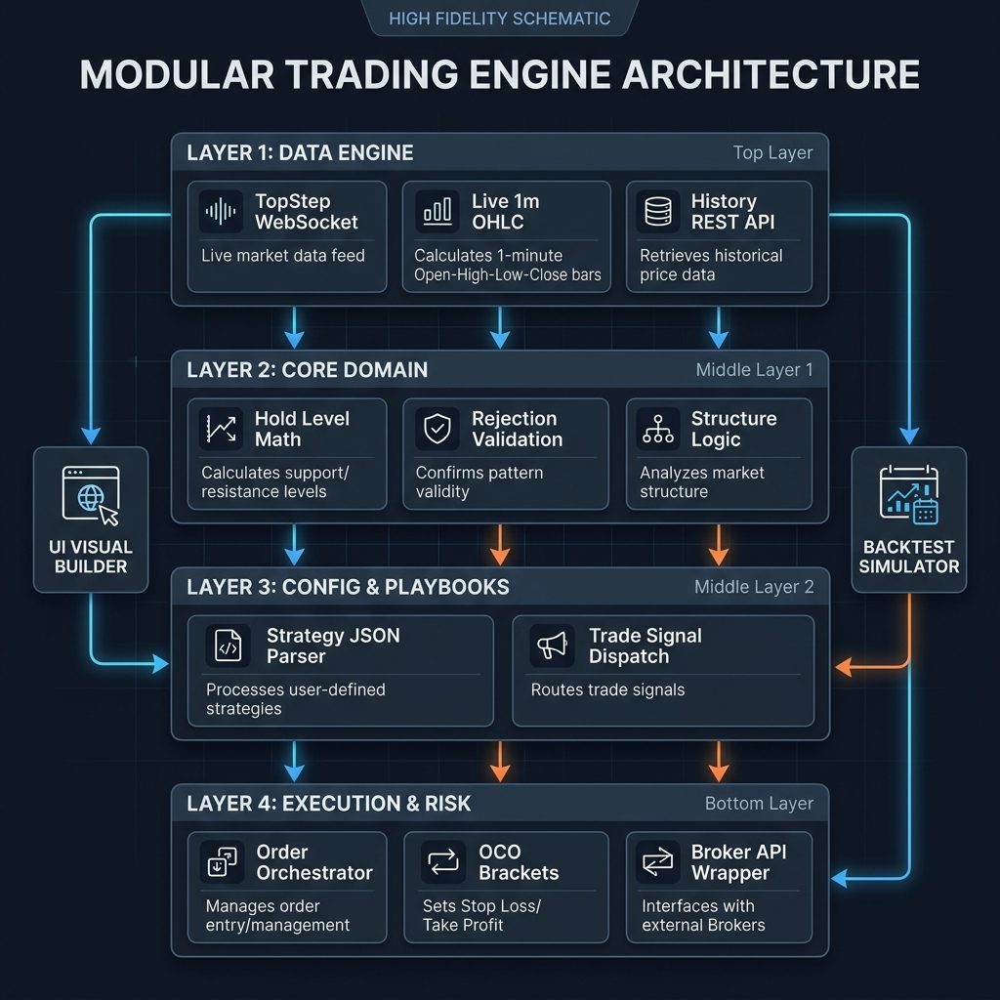
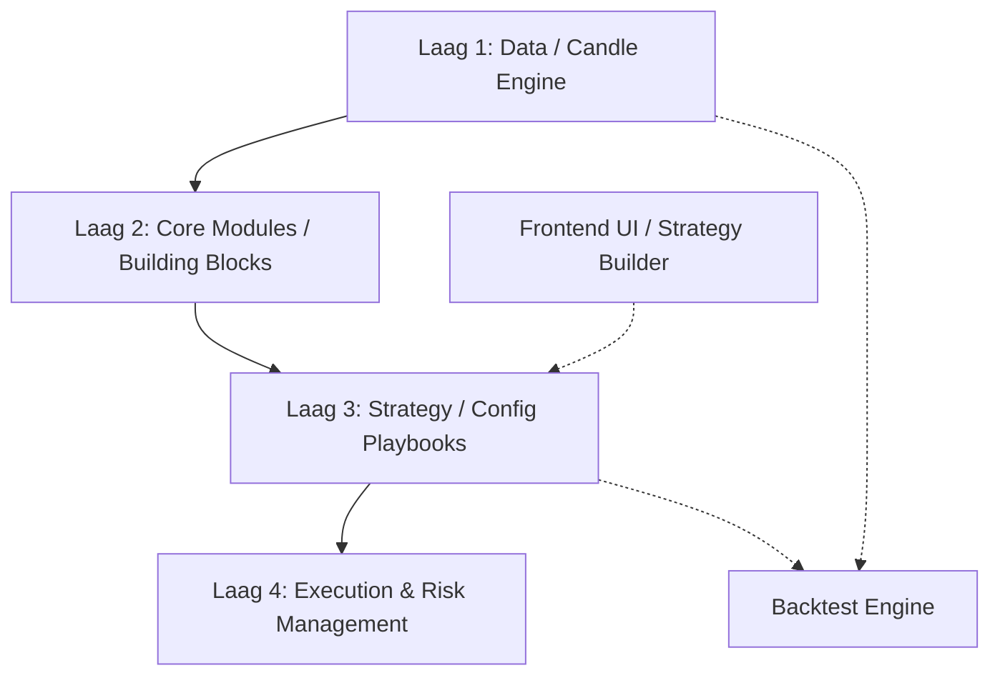

# 🏛️ Institutional-Grade Modular Trading Architecture

*“In de markt win je niet door te voorspellen, je wint door meedogenloos en foutloos te reageren. Dit document beschrijft de fundering van een 8-figure scalping en trading engine: 100% modulair, 100% objectief en meedogenloos schaalbaar.”*

---

## 1. De Architectuur Filosofie (Separation of Concerns)
Een schaalbaar daytrading-systeem sneuvelt zodra theorie, netwerk-code en order-logica door elkaar lopen. We hanteren daarom een **strikte gelaagde architectuur**. Lagen praten uitsluitend met elkaar via interfaces. Je kunt de broker, de theorie, óf de strategie vervangen zonder dat het andere deel breekt.





---

## 2. Laag 1: De Data Pipeline (The Candle Engine)
Alles begint bij schone, multi-timeframe markt data. Dit is de slagader van het systeem.
*   **Invoer**: 1-minuut OHLC(V) data via TopStep (REST/WebSockets).
*   **Historisch & Real-Time Sync**: Bij opstart laadt de engine een verplichte set X dagen historische 1M data in. Real-time WebSockets sluiten hier naadloos op aan, zodat er nooit een 'gat' in de data is. Dit wordt gecachet (bijv. SQLite, Redis of memory DataFrames).
*   **Timeframe Agnostic Resampler**: De 1M basisdata wordt *on-the-fly* of via een worker thread geconverteerd naar 3m, 5m, 15m, 1h, 4h, en 1D.
*   **Single Source of State**: Als een hogere laag om de "huidige state" vraagt, levert deze engine gestandaardiseerde, kant-en-klare data-objecten in het juiste timeframe.

---

## 3. Laag 2: Core Domain (Immutable Building Blocks)
Dit zijn jouw **Vaste Termen**. Dit is pure wiskunde en marktstructuur. Elke module (in een eigen `.py` bestand) doet exact 1 ding en kent geen strategieën, geen winst of verlies, puur data in -> objectieve theorie uit.
*   **`hold_level.py`**: Identificeert uitsluitend de push en de pullback (wicks/bodies). 
*   **`break_level.py`**: Registreert candle-color reeksen en wiskundige breaks.
*   **`origin_level.py`**: Erft of luistert naar Break Levels en telt separaties.
*   **`hard_close.py` / Validators**: Bevat pure methodes (`is_hard_close(...)`) die `True` of `False` teruggeven op basis van strikte CCTA randvoorwaarden.
*   **`trends.py` & Diagonals**: Er is één wiskundige manier om de theorie-trendlijn te bepalen, wat onafhankelijk van master-controller verhoudingen in L2 wordt berekend.
*   *Let op: Termen zoals "Master" en "Controller" zijn strict configuraties (the Master is de dominantere bias van theorie X op timeframe Y). L2 levert slechts de bouwstenen - de hiërarchie tussen deze blokken wordt samengeknoopt in Laag 3.*

---

## 4. Laag 3: Variabele Configuratielaag (The Playbooks)
Hier gaan we creatief worden met "Legoblokjes". Binnen deze laag leven **Strategie Playbooks**. 
*   Een Playbook is een configuratie (JSON/YAML of een pure Python dataclass) die simpelweg parameters afgeeft aan de Core Modules en componenten combineert (De "Master & Controller" hiërarchie).
*   **Tactische Add-ons (RATs, Triggers, Shields)**: Entry theorie zoals *Rejection As Target* of *Triggers* zijn executiebeslissingen (verwachte gedragingen). L2 trackt ze niet als op-zichzelf-staande objecten, maar L3 configureert of we op deze theoriemuren anticiperen voor Trade Entry.
*   **Variabelen**: `max_origin_tests`, `entry_offset_ticks`, `trend_timeframe_alignment`, `allow_counter_trend`.
*   **Rule Engine**: Vergelijkt continu de huidige wiskundige staat (van Laag 2) met het Playbook (van Laag 3). *Is de theorie LONG? Is Origin <= 2x getest? Is er geen Hard Close tegen ons?* -> Zend signaal naar Executie.
*   Dit is de laag die straks wordt samengeklikt via de React frontend.

---

## 5. Laag 4: Execution & Risk Management (The Vault)
Zodra Laag 3 een instap rechtvaardigt, neemt de Executie Laag het roer over.
*   **Fleet Commander (Multi-Account Routing)**: Eén instantie van de Engine kan tientallen accounts tegelijk besturen. De Commander heeft een *Deployment Map* (bijv. "Run Strategie A op Account X met 2 contracten, Run Strategie B op Account Y met 1 contract"). Als Strategie A vuurt, vuurt de Commander specifiek de API-calls naar Account X via de juiste API-keys, via geïsoleerde asynchrone threads (FastAPI / asyncio worker). 
*   **Risk Engine**: Controleert vóór de trade harde grenzen per account: *Max Daily Loss bereikt? Zitten we niet in nieuws (NFP/FOMC)? Is de spread niet te hoog?* Zo ja -> Blokkeer trade.
*   **Order Orchestrator**: Ontvangt "Ga LONG vanaf Hold Level Y". Berekent de daadwerkelijke afstand in Ticks voor SL/TP op basis van Playbook wiskunde, en stuurt de OCO-bracket direct mee in het de Limit order payload naar de Broker.
*   **State / Position Manager**: Heeft een continue WebSocket stream open op de `user hub` van de broker. Bewaakt live posities per verbonden account en logt elke wijziging in de Trade Metrics Tabel, ongeacht of de trade via de bot of manueel werd gesloten.

---

### *Waterdicht Code Voorbeeld (Interface Isolatie)*
Hoe ziet die beruchte absolute "Separation of Concerns" er in code uit voor Laag 2? Elke theorie module is 'pure wiskunde'.

```python
# module: hold_level_detector.py
def detect_candidate(historical_candles: list[dict], origin_timestamp: int) -> dict | None:
    """
    Puur wiskundige scan. Heeft GEEN kennis van accounts, strategie of orders.
    Retourneert puur de hoogste ongeteste groene (bullish) candle (of inverse voor support) 
    vanuit het target window.
    """
    candidates = [c for c in historical_candles if c['timestamp'] >= origin_timestamp and c['is_bullish']]
    if not candidates:
        return None
        
    highest_candidate = max(candidates, key=lambda x: x['high'])
    
    return {
        "timestamp": highest_candidate['timestamp'],
        "price_high": highest_candidate['high'],
        "price_low": highest_candidate['low'],
        "status": "candidate"
    }
```

---

## 6. De Backtest Engine (Lab Environment)
Omdat de architectuur in lagen is gesplitst, is het bouwen van de beste backtester ter wereld slechts een kwestie van Laag 1 en Laag 4 door "Nep" modules vervangen:
1.  We zetten een CSV met willekeurige 1M historie in de **Candle Engine** en draaien dit versneld af (een For-loop over OHLC).
2.  De theorie (Laag 2) en de Strategie (Laag 3) werken **exact hetzelfde** als live, omdat ze geen notie van tijd hebben. 
3.  Zodra Laag 3 een trade stuurt, vangt een virtuele **Execution Engine** hem af. 
4.  Omdat we met *Limit Orders* spelen, is backtesten extreem zuiver: als de low van de OHLC 1 minuut bar lager/gelijk is aan het Limit niveau, ben je strict *filled*. We kunnen zelfs sub-minuut logica implementeren (bijv. High viel eerst op de M1 of Low) voor 100% uitsluitsel.

---

## 7. Toekomst / Schaalbaarheid (Frontend Integration)
Door The Playbooks te representeren als gestandaardiseerde JSON schemas, kunnen we een React / FastAPI interface bouwen:
*   Op de Frontend open je een leeg canvas. 
*   Je versleept de "Origin Level Module", configureert "Max hit = 1".
*   Je klikt op **Run Backtest**. De backend pompt de CSV in 2 seconden door de architectuur. Je krijgt een winrate, PnL curve en Risk/Reward heatmap.
*   Klopt het? Klik "**Save to GitHub**", waarna deze configuratie via Git operations wordt geborgd als officieel Playbook dat de tradeserver om 15:30 (NY) automatisch kan gaan handelen.

> *We sluiten compromissen uit. Code doet wat theorie dicteert, theorie luistert naar data, executie waarborgt de liquiditeit.*

---

## 8. Data Vault & Metrics Logging (De Oefen- en Optimalisatieomgeving)

Om onze "Reference Strategy" straks live te besturen - en te finetunen - gaan we blind op data. Daarom capturen we **elke tick** en elk theorie-besluit in een gestructureerde tabel-database. We leggen op de milliseconde nauwkeurig twee hoofdcategorieën vast, net zoals we eerder succesvol bewezen hebben maar dan veel uitgebreider.

### A. Ijkmomenten & Theoriestaten (Event Logging per State)
Voordat we überhaupt aan een trade denken, registreren we de wiskundige staat en transities van de theorie:
*   **Volledige OHLC-data**: Niet alleen sluitingsprijzen, maar de exacte structuur data (Open, High, Low, Close, Volume) op het moment dait een event zich voordoet.
*   **Origin State**: Tijdstip + prijs waarop een Break Level exact valideert tot een werkend Origin Level.
*   **Kandidaat vs. Validatie State Mappen**: 
    *   *Kandidaat Tracking:* Zodra een Hold Level Kandidaat zich aandient, loggen we direct zijn Timestamp, Prijs en Status (`candidate`). Verschuift de theorie de status naar een betere (hogere/lagere) kandidaat? Dan overschrijven dan wel markeren we de oude als obsolet en loggen we de allernieuwste Kandidaat.
    *   *Validatie (Hold level Upgrade):* Het exacte moment dat validatie optreedt (een Hard Close over/onder de kandidaat). We loggen de specifieke Validation Timestamp, Validation Price en de definiteve Status transformatie (`candidate` -> `valid_hold_level`).
*   **Logica Limits & Active Orders**: Op het moment van Theoriemuur/Hold level validatie, slaan we op welk type order het Playbook inlegt (Limit Limit Order), de timestamp van het inleggen in het orderboek van de broker, en of de order `pending`, `filled` of `canceled` (bijv. door timeframe overschrijding) is.
*   **Test Momenten**: Tijdstip en data van theoriemuur-tests (met ingebouwde Test Count tracker).

### B. Trade Executie & Performance Metrics (Trade Table)
Wanneer Laag 3 (de Playbook config) oordeelt dat een trade uitgevoerd moet worden vanaf een Hold Level, loggen we het volgende in één breed dataframe per executie:
*   **Algemeen**: Datum, Instrument (bijv. NQ), Exacte Timeframe.
*   **Trade Data**: Richting (Long/Short), Entry Prijs, Trigger Tijdstip, Playbook Strategie ID.
*   **Risk Variables config**: Ingestelde Stop Loss (SL) prijs en Take Profit (TP) prijs volgens het gekozen Playbook schema. 
*   **Verschuivingen / Max Excursion (Cruciaal voor tuning!)**: We loggen exact *tot hoever* de prijs in de richting van je TP is gepulsed voordat hij omdraaide (Maximum Favorable Excursion / MFE). Anderzijds: *tot hoever* trok de prijs eerst door tot tegen onze SL aan alvorens weg te schieten (Maximum Adverse Excursion / MAE). 
*   **Sluiting**: Hit TP? Hit SL? Of handmatig de OCO bracket gesloten? Win/Loss ratio.
*   **Financieel**: Net PnL op de trade, Max Drawdown van de sessie direct na deze trade.

*(Deze uitgebreide tabellen stellen ons in staat om na 100 oefentrades (via backtesting of live simulatie) de SL/TP afstanden in het JSON Playbook tot op de procent nauwkeurig, objectief te tweaken. We gokken zo nooit op R/R ratios, we laten de opgevangen tabeldata ons vertellen waar de wiskundige sweetspot in pips ligt ten opzichte van een Hold Level entry.)*
